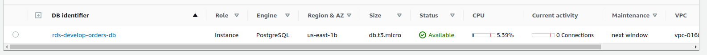

# Data Platform - Automatic deplowment

## 1 - Introduction and project overview

This project was developed to create an infrastructure as a code (IaC) to build a complete data lake enviroment. The deploy is done automatically using github actions and it supports three enviroments: develop, staging and production. The CDK framework is used to orchestrate the creation of the infrastructure.
The full infrastructure diagram is represented below:

imvpivqmemfmgiopmvomrtvropitmoptirm
rtvpokrtpokrtopvkoprkoprkvporrtdf

The layers of the data lake are raw, processed and aggregated.
The ingestion to the raw layer is done using an AWS Database Migration Service, that is responsible for ingesting the data of a RDS postgres instance into the S3 bucket. The RDS postgres instance has its data inserted using a python script.

## 2 - Tecnologies and tools used
* Language: Python 3.8
* AWS Services: RDS, DMS, S3, IAM
* Database: Postgrees


## 3 - Infrastructure:
* S3 bucket: where the parquet files are stored
* RDS instance: a postgres instance that the data will be copied from. To populate the database the script "insert.py" should be executed. It is responsible for connecting to the instance and the insert random data to the database.
* DMS instance: a database migration service that will be used to copy the data from the RDS instance to the S3 bucket.


## 4 - How it works

The project has these banches:
* main
* staging
* develop-**

The main branch is designed to be used in production. It is merged at th end of the scripts development. The staging branch is the default branch. It deploys the staging enviroment. It merges all of the develop-** branches. The develop-** branches are used for each created resource, such as the S3 buckets, RDS instance and DMS.

Every time a push is done to one of those braches an automatically deploy is triggered at the respective enviroment.


### 4.1 - Projects configurations
#### Github secrets

The AWS credentials were saved at project's actions secrets.


#### Env file

For the insertions at the RDS postgres database instance there is a need to use a .env file with the information from the database.
.env
```
USER=<POSTGRES_USER>
PASSWORD=<POSTGRES_USER_PASSWORD>
HOST=<RDS_HOST_ADDRESS>
```

#### AWS account configuration

One small configuration must be done to successfully deploy the platform. a DMS VPC role must be previously defined. To do this simply configure a new role at IAM panel, selecting DMS as service and add the AmazonDMSVPCManagementRole policy. Call this new role dms-vpc-role.

### 4.2 - Development steps
#### S3 Buckets

Development branch: develop-s3-bucket-creation-stack

The buckets were divided at three different layers:
* raw: stores the data as it is
* processed: stores the data after a ETL process from the data at raw layer
* Aggregated: stores the data after aplying bussiness rules to be then queried/analyzed by final users

If you need more information about data lake layers, I did a small project describing it. ([Link](https://github.com/PHTF92/data-lake-example))

After pushing the github action is triggered, the stack is created and the deploy is done.


The files used by SDK framework are at data_lake folder.


* base.py: has the base s3 class to the buckets that will be used in it layer, responsible for standardize buckets names and configurations (e.g. public access, enabling versioning, etc).
* stack.py: calls the creation of the stack, following the respective enviroment location.


#### RDS postgres instance

Development branch: develop-rds-instance

To migrate the data to the buckets first it was needed to have a source. So, it was created a RDS postgres instance. 




The instance, after being created had data inserted using the script at scripts/insert_to_rds.py. To do this, the user, host and password of the created database was gathered from secrets manager and then the values were copied to .env file. Then the insertion script was executed runnig:

```
python3 scripts/insert_to_rds.py
```

This script inserted created a table called orders that have four columns: id, product name, price and data of creation and random data was generated and inserted every 0.2 seconds.


The insertion continues for a long time, it just ended after the migration task have started. 


#### DMS

Development branch: develop-dms-instance

After having a source to migrate the data (postgres database) and a target (bucket at raw layer) the DMS instance was created.


The migration follows a full load + CDC method. It first loads all the data and then it loads only the updated/new data. If you need more information about DMS and methods of database migration, I did a small project describing it. ([Link](https://github.com/PHTF92/db-ingestion))

The migration was triggered manually and the data was then saved to the S3 bucket.


#### Kinesis firehose

Development branch: develop-kinesis


Another source of data to the raw layer was a kinesis firehose ingestion. The firehose was created and configured to ingest data from fake web events simulated running the script put_to_firehose.py. This script connects with the firehose and publishes several random web navigation events. The kinesis than dumps the JSON data into the s3 bucket.


#### Glue catalog

Development branch:develop-glue-catalog


To detect schema of the previously ingested data from the kinesis stream it was created a crawler in glue catalog. For the data ingested from the RDS instance the schema was declared (just a few columns).


The created tables schemas can be accessed at the glue catalog table's list


Orders table schema:


Atomic events schema:


#### AWS Athena

Development branch: develop-athena


Athena is a service that can be used to query the data directly from the S3 bucket at rae layer. It is useful to exploring, inspect, and validating the data that was ingested.


#### Databricks and SPARK

Development branch: develop-databricks

To extract, transform and load the data from the raw layer to the processed layer it was used Spark jobs. The spark cluster was managed by Databricks enviroment and the deployment was made using CDK.


The notebook containing the code can be find at "jupyter_notebooks/spark-etl.ipynb".

With atomic_events table, that was stored at raw layer in JSON format, the objective of the ETL job was to save it at the processed layer in delta format, add three new columns (etl_timestamp, event_date, source_filename) and partition the data by event_date.

With orders table, that was stored at raw layer in parquet format, the objective of the ETL job was the same of the job at atomic_events.

If you want to see more complex ETL Spark jobs, I did a  project with some examples. ([Link](https://github.com/PHTF92/data-lake-example))

#### Redshift

Development branch: develop-redshift

To query the data inside the processed layer an AWS Redshift Spectrum instance was created.


To connect to the instance it was used DBeaver.

The password can be found at "secrets manager".


Once connected an external schema was created. 
([Link](https://docs.aws.amazon.com/pt_br/redshift/latest/dg/r_CREATE_EXTERNAL_SCHEMA.html))

```SQL
CREATE EXTERNAL SCHEMA data_lake_processed
FROM DATA CATALOG
DATABASE 'glue_phtf_develop_data_lake_processed'
REGION 'us-east-1'
IAM_ROLE 'arn:aws:iam::633372182605:role/develop-redshift-stack-iamdevelopredshiftspectrumr-17SHA0ZN6UN7U'
```


So now we have the Redshift connected to Glue Catalog and we can query the data.

* Atomic Events


* Orders


